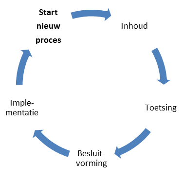

## Gebruik van het wijzigingsprotocol 

Het protocol schrijft een vast stramien voor het wijzigen van de standaard voor. Het protocol benoemt de fasen en de op te leveren resultaten. Belangrijk zijn de randvoorwaarden en uitgangspunten. De gebruikers van het informatiemodel Externe Veiligheidsrisico’s betrekken wij bij het wijzigen van het model. We zetten op en rij welke betrokkenen er zijn.

### Protocol versus proces

De titel van dit document geeft aan dat het hier om een protocol gaat. Toch wordt in dit document ook gesproken over processen. Een <b>wijzigingsprotocol </b>beschrijft de <i>manier waarop</i> wijzigingen in het Informatiemodel Externe Veiligheidsrisico’s plaatsvinden: het <b>wijzigingsproces</b>. In het protocol zijn basisbegrippen en uitgangspunten uiteengezet voor het wijzigingsproces, bijvoorbeeld wat onder nieuwe en volgende versies verstaan wordt en wanneer deze verwacht mogen worden. De daadwerkelijke planning van een nieuwe versie wordt in overleg met de opdrachtgever en eigenaar van de standaard, het ministerie van Infrastructuur en Waterstaat, en de beheerder van de Register Externe Veiligheid (REV) jaarlijks opgestelt.

Met behulp van een wijzigingsprotocol voor het Informatiemodel Externe Veiligheidsrisico’s geeft Geonovum:

<ul><li>inzicht in het behandel- en besluitproces dat ten grondslag ligt aan het versiebeheer;</li>
<li>inzicht in de wijzigingsverzoeken;</li>
<li> inzicht in een voorgestelde wijziging van de standaard;</li>
<li>stabiliteit aan de standaard;</li>
<li>continuïteit aan de standaard;</li>
<li>een eenduidige aanpak.</li>
</ul>

### Releasebeleid  
#### Nieuwe versie van de standaard

Een release van een standaard is een nieuwe uitgave van de standaard. De nieuwe release kenmerkt zich ten opzichte van de oude versie door een hoger versienummer. Een release betreft 1 product van een standaard of is een bundel van meerdere producten van de betreffende standaard. Bij de release is ieder product is voorzien een nieuw versienummer conform X.Y.Z schrijfwijze (zie hierna) en een status.

Bij een standaard in beheer horen ook afspraken over het versiebeheer. Versies van een standaard zijn er in verschillende gradaties die elk een relatie hebben met een voorgaande versie. De wijzigingen documenteren wij en leggen wij vast in een apart document bij de uitgebrachte versie van de standaard. De gebruiker kan zo nagaan op welke plaatsen de betreffende standaard gewijzigd is.

Elk product van onze standaarden voorzien wij van een versienummer. Dit doen wij conform Semantic Versioning (SemVer). Elk product heeft zijn eigen versienummer conform X.Y.Z schrijfwijze, bijvoorbeeld versie 2.1.0 (=X.Y.Z):

<ul><li><b>X-wijzigingen</b> Deze wijzigingen veranderen de structuur van de standaard. Hierdoor zijn X-wijzigingen niet backwards compatible. Frequentie: in overleg met de opdrachtgever.</li></ul> 

<ul><li><b>Y-wijzigingen</b> Dit zijn wijzigingen die niet de structuur veranderen. Dit kunnen bijvoorbeeld updates zijn of inhoudelijke aanpassingen aan objecten, attributen of waarde lijsten of de reikwijdte van de standaard. Deze wijzigingen zijn backwards compatible. Frequentie</u>: in overleg met de opdrachtgever.</li> </ul>

<ul><li><b>Z-wijzigingen</b> Dit zijn in feite oplossingen van technische fouten of verbeteringen van technische aard. Deze wijzigingen zijn backwards compatible. Frequentie: zo spoedig mogelijk na constatering.</li> </ul>

#### Oudere versie van een standaard

Na het uitbrengen van een nieuwe versie van een bij Geonovum in beheer zijnde standaard blijven oudere versies beschikbaar en zijn vindbaar via de <a href='https://www.geonovum.nl/geo-standaarden/informatiemodel-externe-veiligheid' target='_blank'>Geonovum website</a> en de registers (de <a href='https://definities.geostandaarden.nl' target='_blank'>conceptenbibliotheek</a>, het <a href='https://register.geostandaarden.nl' target='_blank'>technisch register</a> en het <a href='https://docs.geostandaarden.nl' target='_blank'>documentenregister</a>). Een nieuwe versie dwingt daarmee geen directe overstap af bij de gebruikers, tenzij anders (bijvoorbeeld wettelijk, bij ministeriële regeling) bepaald. Na het uitbrengen van de nieuwe versie van een standaard wordt de ontwikkeling van de oude versie stopgezet.

De SemVer-methodiek schrijft backwards compatibility voor op het Y-niveau. Na het uitbrengen van een nieuwe versie van een bij Geonovum in beheer zijnde standaard blijven oudere versies beschikbaar en zijn vindbaar via de <a href='https://www.geonovum.nl/geo-standaarden/informatiemodel-externe-veiligheid' target='_blank'>Geonovum website</a>. Een nieuwe versie dwingt daarmee geen directe overstap af bij de gebruikers, tenzij anders (bijvoorbeeld wettelijk) bepaald. Na het uitbrengen van de nieuwe versie van een standaard wordt de ontwikkeling van de oude versie stop gezet.

Voor het onderhoud en de ondersteuning van een oude versie van een standaard gelden de volgende uitgangspunten:

<ul><li>Aan een oude versie worden geen nieuwe features toegevoegd, geen aanpassingen gedaan op X en Y niveau na het uitbrengen van een nieuwe versie. Verzoeken om aanpassing en wijziging voor nieuwe functionaliteit worden niet meer voor de oude standaard in behandeling genomen maar doorgegeven aan het ontwikkelteam. Correcties (Z-wijzigingen) worden wel uitgevoerd op de vorige versies zolang deze nog ondersteund worden.</li>
<li>Bij oplevering van een nieuwe versie wordt de voorgaande versie nog een van te voren vastgestelde periode ondersteund. De duur van de overgangsperiode wordt mede bepaald door de omvang van de wijzigingen (X, Y en Z wijzigingen op de vorige versies), de staat van ontwikkeling van de standaard, en of de standaard in voorlopig dan wel permanent beheer is.</li>
<li>De duur van de ondersteuningsperiode voor de diverse soorten versies moet nog worden vastgesteld. Tot aan inwerkingtreden van de Omgevingswet, waar de Informatiemodel Externe Veiligheidsrisico's ook onder valt, zal naar verwachting de ondersteuningsperiode van verschillende versies anders zijn, dan in de periode van permanent beheer zonder dat daarnaast nog grootschalige ontwikkeling van de standaard plaatsvindt.</li>
</ul>

### Proces varianten

In paragraaf <a href='#releasebeleid'>2.2 zijn de X, Y en Z wijzigingen uitgelegd. Voor wijzigingen kent Geonovum twee proces varianten. Eén voor X en Y wijzigingen en één voor Z wijzigingen.

<b>Proces voor X en Y wijzigingen</b>

Deze vergen volledige afstemming en het doorlopen van alle in paragraaf <a href='#fasen-en-resultaten'>2.4 beschreven fasen: Inhoud, Toetsing, Besluitvorming en Implementatie. Voor de inhoudelijke fase wordt een werkgroep gestart met daarin vertegenwoordiging van belangrijke stakeholders/gebruikers. Het resultaat van de werkgroep wordt tijdens het overleg van de Adviesgroep besproken. De Adviesgroep adviseert de opdrachtgever. Besluitvorming over vaststelling van een nieuwe versie van het model vindt plaats door IenW. 

<b>Proces voor Z wijzigingen</b>

Deze dienen zo snel als mogelijk uitgevoerd te worden. De inhoudelijke fase wordt door een medewerker van Geonovum gedaan. Toetsing vindt plaats door middel van werksessies met de werkgroep.  Implementatie vindt plaats door het publiceren van de wijziging op de website van Geonovum.

### Fasen en resultaten

Het volledige wijzigingsproces doorloopt de fasen Inhoud, Toetsing, Besluitvorming en Implementatie, zoals weergegeven in <a href='#_Ref503260625'>Figuur 1.

<figure style='width: 35%;'></img>
<figcaption>Fasen wijzigingsproces</figcaption></figure>

<b>Inhoud</b>

In de fase inhoud wordt voor iedere melding bepaald of deze wordt opgenomen in de nieuwe versie van de standaard of niet. Dit wordt door Geonovum intern vastgelegd in Jira en is raadpleegbaar op de website van Geonovum. Voor meldingen die worden meegenomen in de nieuwe versie van de standaard, worden oplossingen uitgewerkt, op basis waarvan vervolgens de specificatie wordt aangepast. Dit gebeurt door Geonovum in samenwerking met inhoudelijke experts in de werkgroep. Afhankelijk van de omvang van de wijziging ten opzichte van de voorgaande versie is de groep van experts evenredig groter of kleiner.

<b>Toetsing</b>

De fase Toetsing vormt een brug tussen de inhoud, besluitvorming en de implementatie. In deze fase wordt eenieder (X, Y wijziging) of een beperkte groep belanghebbenden (Z wijziging) uitgenodigd om zijn visie te geven op de nieuwe versie van de standaard. De reacties uit de consultatie worden verwerkt in de specificatie.

<b>Besluitvorming</b>

Bij Besluitvorming wordt besloten om de gewijzigde specificatie vast te stellen en te publiceren. Afhankelijk van het type wijziging (X, Y of Z, zie paragraaf <a href='#proces-varianten'>2.3), besluit het ministerie van IenW.

<b>Implementatie</b>

Het in gebruik nemen van het Informatiemodel in de praktijk staat centraal in deze fase. Hiervoor leveren we verschillende technische bestanden op, zoals implementatiebestanden, voorbeeldbestanden en voorbeeldberichten. Deze bestanden ondersteunen softwareleveranciers bij de implementatie van de standaard in hun software. Beheerders van de voorziening/ het register e.d. nemen het informatiemodel in gebruik. Wij ondersteunen de implementatie bovendien door de werking van het informatiemodel toe te lichten op bijvoorbeeld tijdens bijeenkomsten en bijvoorbeeld ‘inloopspreekuren’ voor de softwareleveranciers. Resultaat van deze fase is dat de gebruikers data kunnen maken en uitwisselen conform de nieuwe standaard. In <a href='#implementatie-ondersteuning'>Hoofdstuk 5 lichten we de implementatie verder toe.

### Betrokkenen

De volgende groepen en instanties (actoren) zijn betrokken bij het wijzigingsproces van het Informatiemodel:

<ul><li>Aviesgroep</li>
<li>Expert- en gebruikersgroepen</li>
<li>Softwareleveranciers</li>
<li>Geonovum</li>
<li>Rijkswaterstaat</li>
<li>Ministerie van Infrastructuur en Waterstaat</li>
</ul>

Nieuwe versies van het informatiemodel bereidt Geonovum voor in samenwerking met de beheerder van het REV (Rijkswaterstaat), expert- en gebruikersgroepen en softwareleveranciers. We streven naar een unanieme instemming met de standaard. Dit versterkt het draagvlak en zorgt voor een betere implementatie van het informatiemodel in het werkveld. 
Het wijzigingsvoorstel (de bundeling van wijzigingsverzoeken) leggen wij voor aan de Adviesgroep IMEV. In de adviesgroep wordt niet meer de inhoud van het wijzigingsvoorstel besproken; dit ligt bij het beheerteam IMEV van Geonovum die het wijzigingsvoorstel voorbereidt. De adviesgroep toetst het proces, waaronder dat het wijzigingsvoorstel langs het in de bronhouders- en softwareleveranciers overleggen is toegelicht en feedback is opgehaald. Het wijzigingsvoorstel wordt altijd voorzien van een oplegnotitie zoals dat nu het geval is,
inclusief of er aandachtspunten zijn. 
