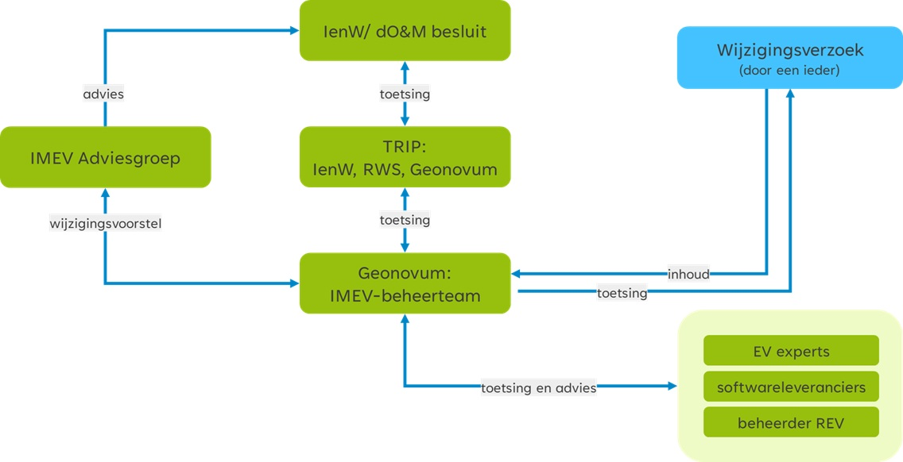

# Gebruik van het wijzigingsprotocol {#1D9C774B}
Het protocol schrijft een vast stramien voor het wijzigen van de standaard voor. Het protocol benoemt de fasen en de op te leveren resultaten. Belangrijk zijn de randvoorwaarden en uitgangspunten. De gebruikers van het informatiemodel Externe Veiligheid betrekken wij bij het wijzigen van het model. We zetten op en rij welke betrokkenen er zijn.

## Protocol versus proces {#0E06C02F}
De titel van dit document geeft aan dat het hier om een protocol gaat. Toch wordt in dit document ook gesproken over processen. Een <b>wijzigingsprotocol </b>beschrijft de <i>manier waarop</i> wijzigingen in het Informatiemodel Externe Veiligheid plaatsvinden: het <b>wijzigingsproces</b>. In het protocol zijn basisbegrippen en uitgangspunten uiteengezet voor het wijzigingsproces, bijvoorbeeld wat onder nieuwe en volgende versies verstaan wordt en wanneer deze verwacht mogen worden. De daadwerkelijke planning van een nieuwe versie wordt in overleg met de opdrachtgever en eigenaar van de standaard, het Ministerie van Infrastructuur en Waterstaat, en de beheerder van de Register Externe Veiligheid (REV) periodiek afgestemd.
Met behulp van dit wijzigingsprotocol voor het Informatiemodel Externe Veiligheid geeft Geonovum:
<ul><li>inzicht in het behandel- en besluitproces dat ten grondslag ligt aan het versiebeheer;</li>
<li>inzicht in de wijzigingsverzoeken;</li>
<li>inzicht in een voorgestelde wijziging van de standaard;</li>
<li>stabiliteit aan de standaard;</li>
<li>continuïteit aan de standaard;</li>
<li>een eenduidige aanpak.</li>
</ul>
 

## Releasebeleid {#36DFA7EB}

### Nieuwe versie van de standaard {#3D39B6AA}
Een release van een standaard is een nieuwe uitgave van de standaard. De nieuwe release kenmerkt zich ten opzichte van de oude versie door een hoger versienummer. Een release betreft 1 product van een standaard of is een bundel van meerdere producten van de betreffende standaard. Bij de release is ieder product voorzien van een nieuw versienummer conform X.Y.Z schrijfwijze (zie hierna) en een status. Het JSON-schema en de voorbeeldbestanden hebben daarom ieder hun eigen versienummer. 
 
 
Bij een standaard in beheer horen ook afspraken over het versiebeheer. Versies van een standaard zijn er in verschillende gradaties die elk een relatie hebben met een voorgaande versie. De wijzigingen documenteren wij en leggen wij vast het betreffende product. De gebruiker kan zo nagaan wat er is gewijzigd.
Elk product van onze standaarden voorzien wij van een versienummer. Dit doen wij conform Semantic Versioning (SemVer). Elk product heeft zijn eigen versienummer volgens de X.Y.Z schrijfwijze. We hanteren drie typen versies voor een wijziging van een standaard. Bijvoorbeeld: versie 2.1.0 (=X.Y.Z):
 
 
<ul><li><b>X-wijzigingen</b> Dit zijn grote wijzigingen die de structuur van de standaard veranderen. Hierdoor zijn X-wijzigingen niet backwards compatible. Frequentie: in overleg met de opdrachtgever.</li>
<li><b>Y-wijzigingen</b> Dit zijn wijzigingen die niet de structuur veranderen. Dit kunnen bijvoorbeeld updates zijn of inhoudelijke aanpassingen aan objecten, attributen of waardelijsten of de reikwijdte van de standaard. Deze wijzigingen zijn backwards compatible. Frequentie: in overleg met de opdrachtgever.</li>
<li><b>Z-wijzigingen</b> Dit zijn in feite oplossingen van technische fouten of verbeteringen van technische aard, alsmede tekstuele verbeteringen. Deze wijzigingen zijn backwards compatible. Frequentie: zo spoedig mogelijk door Geonovum na constatering.</li>
</ul>
 
 

### Consultatie {#7AB762DE}
Met het doorontwikkelen van het informatiemodel leveren wij nieuwe versies van de producten van de IMEV op. Doel van een consultatie is ons netwerk, de gebruikers van de standaard en de ketenpartners, te raadplegen. Wij vragen om advies, zodat het IMEV zo goed mogelijk aansluit op de werkprocessen in de uitvoeringspraktijk. 
De consultaties zijn openbaar/ publiek en daardoor mag iedereen reageren op de nieuwe versie. Consultaties duren minimaal 3 weken en maximaal 8 weken. Bekendmaking gebeurt via de Geonovum website en wordt bekendgemaakt door middel van een nieuwsbericht op de website van Geonovum en via de website van het Register Externe Veiligheid. We attenderen de gebruikers en de ketenpartners via de REV- nieuwsbrief. Wanneer en hoe lang een consultatie plaatst vindt, is afhankelijk van proces varianten bij wijzigingen (zie paragraaf procesvarianten).

### Oudere versie van een standaard {#3F394B87}
Na het uitbrengen van een nieuwe versie van een standaard blijven oudere versies beschikbaar. Ze zijn vindbaar via de <a href='https://www.geonovum.nl/geo-standaarden/informatiemodel-externe-veiligheid' target='_blank'>Geonovum website</a> en de registers (de <a href='https://definities.geostandaarden.nl' target='_blank'>conceptenbibliotheek</a>, het <a href='https://register.geostandaarden.nl' target='_blank'>technisch register</a> en het <a href='https://docs.geostandaarden.nl' target='_blank'>documentenregister</a>). Een nieuwe versie dwingt daarmee geen directe overstap af bij de gebruikers, tenzij anders bijvoorbeeld met een ministeriële regeling is bepaald. Na het uitbrengen van de nieuwe versie van een standaard wordt de ontwikkeling van de oude versie stopgezet. De SemVer-methodiek schrijft backwards compatibility voor op het Y-niveau. 
 
 
Voor het onderhoud en de ondersteuning van een oude versie van het IMEV gelden de volgende uitgangspunten:
<ul><li>Na het uitbrengen van een nieuwe versie worden, worden geen nieuwe features toegevoegd en geen aanpassingen gedaan op X en Y van de oude versie. Verzoeken om aanpassing en wijziging voor nieuwe functionaliteit worden niet meer voor de oude versie in behandeling genomen. Ze worden wel door ons onderzocht. Correcties (Z-wijzigingen) worden wel uitgevoerd op de oude versie zolang deze nog wordt ondersteund.</li>
<li>Bij oplevering van een nieuwe versie wordt de voorgaande versie nog tot een van tevoren vastgestelde periode ondersteund. De duur van de overgangsperiode wordt mede bepaald door de omvang van de wijzigingen (X, Y en Z wijzigingen op de vorige versies), de staat van ontwikkeling van de standaard, en of de standaard in voorlopig dan wel permanent beheer is.</li>
<li>De duur van de ondersteuningsperiode voor de diverse soorten versies moet nog worden vastgesteld. In de eerste jaren na de inwerkingtreden van de Omgevingswet zal de ondersteuningsperiode van verschillende versies anders zijn, dan in de periode van permanent beheer zonder dat daarnaast nog grootschalige ontwikkeling van de standaard plaatsvindt.</li>
</ul>
 
 

## Proces varianten {#3C8E3B5A}
In paragraaf <a href='#36DFA7EB'>2.2</a> zijn de X, Y en Z wijzigingen uitgelegd. Voor wijzigingen kent Geonovum twee proces varianten. Eén voor X en Y wijzigingen en één voor Z wijzigingen.
 
 
<b>Proces voor X en Y wijzigingen</b>
X en Y wijzigingen vergen volledige afstemming en het doorlopen van alle in paragraaf <a href='#73268B03'>3.1</a> beschreven fasen: Inhoud, Toetsing, Besluitvorming en Implementatie. Voor de <i>inhoudelijke fase</i> worden niet alleen de experts en leveranciers betrokken vanuit reguliere overleggen maar ook extra bijeenkomsten met vertegenwoordiging van ketenpartners en gebruikers. Het resultaat van de besprekingen zijn duidelijkere wijzigingsverzoeken en het wijzigingsvoorstel. Gedurende de <i>fase ‘Toetsing’</i> vindt een consultatie (zie paragraaf <a href='#7AB762DE'>2.2.2</a>) van het wijzigingsvoorstel plaats. Hierdoor kunnen alle gebruikers van het IMEV en geïnteresseerden reageren op de komende wijziging. Het wijzigingsvoorstel inclusief de consultatiereacties leggen wij voor aan de IMEV Adviesgroep. De adviesgroep adviseert het Ministerie van IenW (zie <a href='#d6aBfBiBb'>figuur 1</a>). Het Ministerie van IenW <i>besluit</i> over de vaststelling van de nieuwe versie van het Informatiemodel Externe Veiligheid. Na oplevering van de nieuwe versie starten wij de <i>implementatie</i>ondersteuning voor de nieuwe versie. 
 
 
<b>Proces voor Z wijzigingen</b>
Dit betreft kleine wijzigingen die door Geonovum worden uitgevoerd en opgeleverd; dit wordt ook wel een bugfix genoemd. De inhoudelijke fase wordt door het beheerteam IMEV van Geonovum gedaan. Toetsing vindt plaats door middel van werksessies met experts, de beheerder van het REV  en softwareleveranciers. Besluitvorming vindt plaats in afstemming met het Ministerie van IenW. Geonovum publiceert de nieuwe versie via de Geonovum website en informeert direct het Ministerie van IenW, de IMEV Adviesgroep en de softwareleveranciers. Bekendmaking gebeurt via de Geonovum website en wordt bekendgemaakt door middel van een nieuwsbericht op de website van Geonovum en via de website van het Register Externe Veiligheid. We attenderen de gebruikers en de ketenpartners via de REV- nieuwsbrief.

## Betrokkenen {#64077F3F}
De volgende groepen en instanties (actoren) zijn betrokken bij het wijzigingsproces van het Informatiemodel:
<ul><li>IMEV Adviesgroep</li>
<li>Expert- en gebruikersgroepen</li>
<li>Softwareleveranciers</li>
<li>Geonovum</li>
<li>Rijkswaterstaat</li>
<li>Ministerie van Infrastructuur en Waterstaat</li>
</ul>
 
 
<figure id='d6aBfBiBb'></img>
<figcaption>Figuur Betrokkenen bij wijzigingen van het Informatiemodel Externe Veiligheid</figcaption></figure>
 
 
Het IMEV-beheerteam bij <b>Geonovum</b> ontvangt wijzigingsverzoeken ter verbetering van het informatiemodel, gebruik en de bruikbaarheid van het informatiemodel. De wijzigingsverzoeken worden getoetst en van baten en impactanalyses voorzien. Dit doen wij door de wijzigingsverzoeken te toetsen bij experts, softwareleveranciers en de beheerder van het REV. 
De <b>expert- en gebruikersgroepen</b> rondom het REV en het IMEV leveren input op de wijzigingsverzoeken en daarmee doorontwikkeling van het IMEV. Ook toetsen wij de wijzigingsverzoeken bij de <b>softwareleveranciers</b> en <b>Rijkswaterstaat</b> als beheerder van het REV en vragen wij hen ons te adviseren. 
De wijzigingsverzoeken worden door het IMEV-beheerteam gebundeld tot een zelfstandig leesbaar <i>wijzigingsvoorstel</i> dat in verschillende iteraties bij het IMEV Adviesgroep<b> </b>wordt<b> </b>voorgelegd. De <b>IMEV Adviesgroep</b> stuurt op verbinding en samenhang bij de doorontwikkeling van het informatiemodel. Zij brengt advies uit op de door Geonovum voorgestelde wijzigingsvoorstel en legt dit advies voor aan het <b>Ministerie van Infrastructuur en Waterstaat</b> ter besluitvorming. De Directie Omgevingsveiligheid & Milieurisico’s van het ministerie besluit over de voorgestelde wijziging. Bij een positief besluit werkt Geonovum aan de oplevering van de nieuwe versie van het IMEV en gaat over op implementatieondersteuning van de nieuwe versie. 
