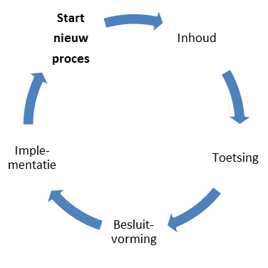

# Wijzigingsproces {#07951E65}
De aanleiding voor een wijzigingsproces is gebaseerd op wijzigingsverzoeken die bij Geonovum binnenkomen via de IMEV helpdesk: de wensen en gevonden fouten in het IMEV zijn aanleiding om de standaard te vernieuwen. Samen vormen zij het wijzigingsvoorstel. Geonovum neemt als beheerder het initiatief om een wijzigingsproces te starten conform dit wijzigingsprotocol.

## Fasen in het wijzigingsproces {#73268B03}
Het volledige wijzigingsproces doorloopt de fasen Inhoud, Toetsing, Besluitvorming en Implementatie, zoals weergegeven in Figuur 2.
</img>
Figuur 2 Fasen wijzigingsproces
 
 
<b>Inhoud</b>
In de fase <i>Inhoud</i> wordt voor iedere wijzigingsverzoek bepaald of deze wordt opgenomen in de nieuwe versie van de standaard of niet. Wijzigingsverzoeken zijn inzichtelijk via de publieke IMEV werkomgeving op <a href='https://github.com/Geonovum/imev-werkomgeving/issues' target='_blank'>GitHub</a>. De link is ook vindbaar via de <a href='https://www.geonovum.nl/geo-standaarden/informatiemodel-externe-veiligheid-imev' target='_blank'>IMEV op pagina van de Geonovum website</a>. Voor wijzigingsverzoeken die worden meegenomen in de nieuwe versie van de standaard, worden baten en impact beschreven en oplossingen uitgewerkt. Dit gebeurt in samenwerking met expert- en gebruikersgroepen, softwareleveranciers en de beheerder van het REV. Afhankelijk van de <a href='#3D39B6AA'>omvang van de wijziging</a> ten opzichte van de voorgaande versie is de groep van te raadplegen experts evenredig groter of kleiner.
 
 
<b>Toetsing</b>
De fase <i>Toetsing</i> vormt een brug tussen de inhoud, besluitvorming en de implementatie. In deze fase wordt eenieder (in het geval van een <a href='#3D39B6AA'>X of Y wijziging</a>) of een beperkte groep belanghebbenden (in het geval van een <a href='#3D39B6AA'>Z wijziging</a>) uitgenodigd om zijn of haar visie te geven op het wijzigingsvoorstel voor de nieuwe versie van het IMEV. Met deze <a href='#7AB762DE'>consultaties</a> vragen wij de gebruikers van de standaard actief hun reactie te geven op het wijzigingsvoorstel. Het wijzigingsvoorstel inclusief de terugkoppeling uit de consultatie wordt verwerkt tot release candidate van het informatiemodel externe veiligheid.
 
 
<b>Besluitvorming</b>
Het wijzigingsvoorstel wordt inclusief de consulatie reacties voorgelegd aan de IMEV Adviesgroep. Zij voorziet het wijzigingsvoorstel van advies. Het Ministerie van Infrastructuur en Waterstaat besluit, afhankelijk van het type wijziging (X, Y of Z, zie paragraaf <a href='#3C8E3B5A'>2.3</a>), over de voorgestelde wijziging.
 
 
<b>Implementatie</b>
Het in gebruik nemen van het Informatiemodel in de praktijk staat centraal in deze fase. Hiervoor leveren wij nieuwe versies op van: 
<ul><li><i>Modeldocument</i><ul><li><i>Begrippenkader</i></li>
<li><i>JSON-schema</i></li>
<li><i>API specificaties </i></li>
<li><i>Voorbeeldbestanden</i></li>
<li><i>Het EAP-bestand met UML-diagrammen</i></li>
</ul>
 
Met deze producten, de IMEV helpdesk en bijeenkomsten ondersteunen wij bij de implementatie van de nieuwe versie van het informatiemodel. Het resultaat van deze fase is dat de gebruikers data kunnen maken en uitwisselen conform de nieuwe versie van het IMEV. In <a href='#15587A4C'>Hoofdstuk 5</a> lichten we de implementatiefase verder toe.

## Inzicht in het wijzigingsproces {#7C8C99BF}
helpdeskmeldingen en wijzigingsverzoeken alsook (inter)nationale ontwikkelingen kunnen  aanleiding geven tot de verdere ontwikkeling het IMEV. Zij worden gebundeld in een wijzigingsvoorstel. Het wijzigingsprotocol geeft richting aan het wijzigingsproces dat dit wijzigingsvoorstel doorloopt. Het ministerie van IenW, besluit na advies van de adviesgroep over het wijzigingsvoorstel. Z-wijzigingen worden door Geonovum zelf besloten en uitgevoerd. 
